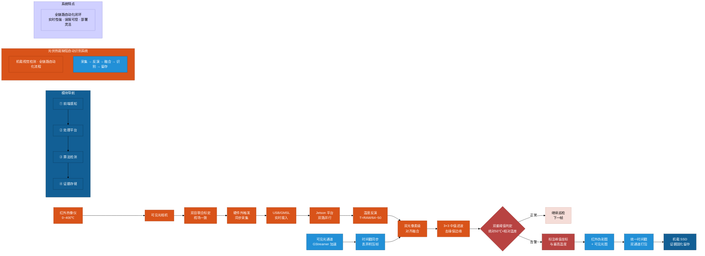

# 光伏热斑缺陷自动识别系统流程图

> 机载视觉检测系统：红外 + 可见光双光融合，Jetson 平台全链路自动化

```mermaid
---
config:
  theme: base
  themeVariables:
    background: "#ffffff"
    primaryColor: "#ffffff"
    primaryTextColor: "#000000"
    primaryBorderColor: "#000000"
    secondaryColor: "#ffffff"
    tertiaryColor: "#ffffff"
    lineColor: "#000000"
    textColor: "#000000"
    clusterBkg: "#ffffff"
    clusterBorder: "#000000"
    edgeLabelBackground: "#ffffff"
    titleColor: "#000000"
    fontFamily: "Microsoft YaHei, sans-serif"
---
flowchart LR
    subgraph NAV["模块导航"]
        direction TB
        N1["① 前端感知"] --> N2["② 处理平台"] --> N3["③ 算法检测"] --> N4["④ 证据存储"]
    end

    subgraph TTL["光伏热斑缺陷自动识别系统"]
        direction TB
        T1["机载视觉检测 · 全链路自动化流程"]
        T2["采集 → 反演 → 融合 → 识别 → 留存"]
    end

    A1["红外热像仪<br/>0~400℃"] --> A2["可见光相机"] --> A3["双目联合标定<br/>视场一致"] --> A4["硬件外触发<br/>同步采集"] --> A5["USB/GMSL<br/>实时接入"] --> A6["Jetson 平台<br/>双路并行"] --> A7["温度反演<br/>T=RAW/64−50"] --> A8["双光像素级<br/>对齐融合"] --> A9["3×3 中值滤波<br/>去噪保边缘"] --> A10{"双重阈值判定<br/>绝对50℃+相对温差"}

    B1["可见光通道<br/>GStreamer 加速"] --> B2["时间戳同步<br/>丢弃积压帧"]
    B2 --> A8
    A10 -- "正常" --> B3["继续巡检<br/>下一帧"]
    A10 -- "告警" --> B4["标注峰值坐标<br/>与最高温度"]
    B4 --> B5["红外伪彩图<br/>+ 可见光图"] --> B6["统一时间戳<br/>双通道打包"] --> B7["机载 SSD<br/>证据固化留存"]

    subgraph NOTE["系统特点"]
        direction TB
        C1["全链路自动化闭环<br/>实时性强 · 误报可控 · 部署灵活"]
    end

    style NAV fill:#125F95,stroke:#0b3a5c,color:#ffffff
    style TTL fill:#D95319,stroke:#a63a0e,color:#ffffff
    style NOTE fill:#D0D0FF,stroke:#9a9adc,color:#000000

    classDef navy fill:#125F95,stroke:#0b3a5c,color:#ffffff
    classDef orange fill:#D95319,stroke:#a63a0e,color:#ffffff
    classDef blue fill:#2290D7,stroke:#16628f,color:#ffffff
    classDef pink fill:#F5DDD8,stroke:#d8a99f,color:#000000
    classDef red fill:#B84341,stroke:#7e2e2d,color:#ffffff
    classDef purple fill:#D0D0FF,stroke:#9a9adc,color:#000000
    classDef title fill:#D95319,stroke:#a63a0e,color:#ffffff
    classDef sub fill:#2290D7,stroke:#16628f,color:#ffffff

    class N1,N2,N3,N4 navy
    class T1 title
    class T2 sub
    class A1,A2,A3,A4,A5,A6,A7,A8,A9 orange
    class A10 red
    class B1,B2 blue
    class B3 pink
    class B4 red
    class B5,B6 blue
    class B7 navy
    class C1 purple
```
