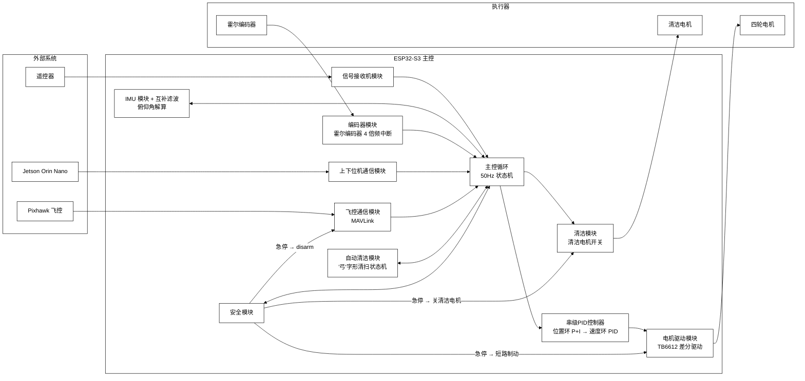
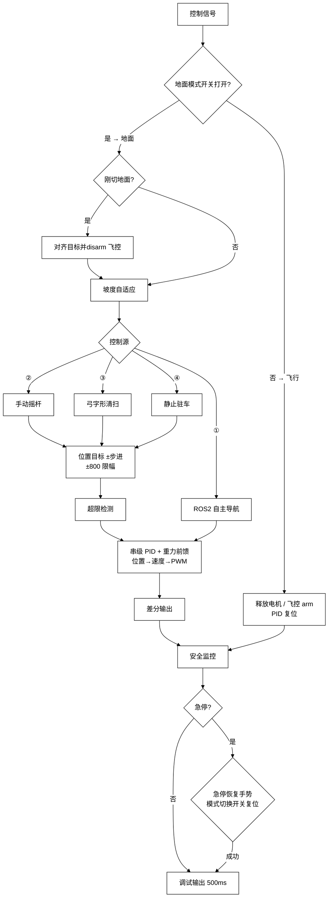
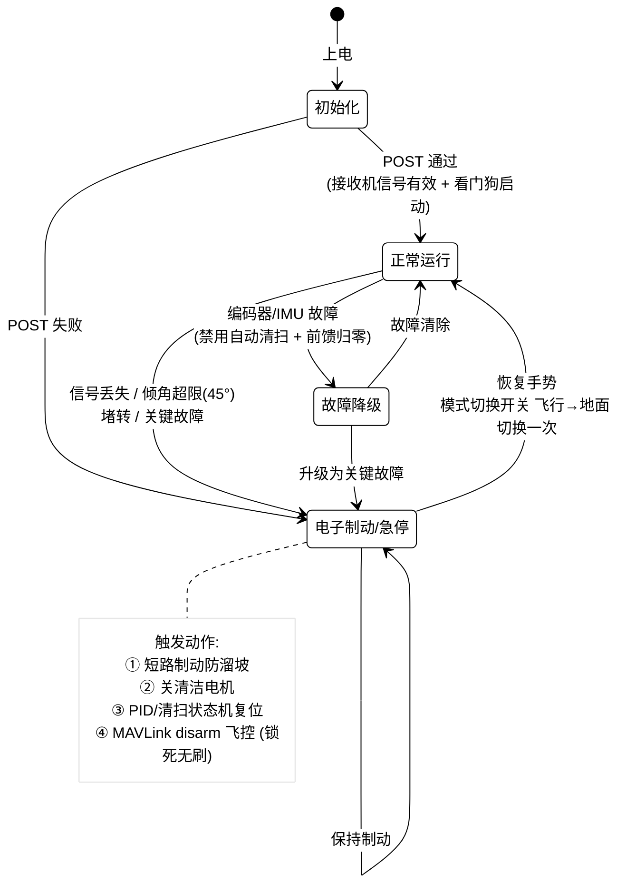

# 底盘控制系统架构图

> 硬件平台: ESP32-S3 (Arduino/PlatformIO) · 控制周期: 20ms (50Hz)

## 1. 系统总体架构

```mermaid
---
config:
  theme: base
  themeVariables:
    background: "#ffffff"
    primaryColor: "#ffffff"
    primaryTextColor: "#000000"
    primaryBorderColor: "#000000"
    secondaryColor: "#ffffff"
    tertiaryColor: "#ffffff"
    lineColor: "#000000"
    textColor: "#000000"
    clusterBkg: "#ffffff"
    clusterBorder: "#000000"
    edgeLabelBackground: "#ffffff"
    titleColor: "#000000"
    fontFamily: "Microsoft YaHei, sans-serif"
---
flowchart LR
    subgraph EXT["外部系统"]
        RC["遥控器"]
        FC["Pixhawk 飞控 "]
        NANO["Jetson Orin Nano "]
    end

    subgraph ESP["ESP32-S3 主控 "]
        direction TB
        RECV["信号接收机模块"]
        IMU["IMU 模块 + 互补滤波<br/>俯仰角解算"]
        ENC["编码器模块<br/>霍尔编码器 4 倍频中断"]
        MAIN["主控循环<br/>50Hz 状态机"]
        PID["串级PID控制器<br/>位置环 P+I → 速度环 PID"]
        AUTO["自动清洁模块<br/>'弓'字形清扫状态机"]
        SAFE["安全模块"]
        MAV["飞控通信模块<br/>MAVLink"]
        COMM["上下位机通信模块"]
        MOTO["电机驱动模块<br/>TB6612 差分驱动"]
        CLN["清洁模块<br/>清洁电机开关"]
    end

    subgraph HW["执行器"]
        M1["四轮电机"]
        M2["清洁电机"]
        E1["霍尔编码器"]
    end

    RC ----> RECV
    FC ----> MAV
    NANO ----> COMM

    RECV --> MAIN
    IMU <----> MAIN
    ENC --> MAIN
    COMM --> MAIN
    MAV --> MAIN
    AUTO <--> MAIN
    SAFE <--> MAIN
    MAIN --> PID
    PID --> MOTO
    MAIN --> CLN
    MOTO --> M1
    CLN --> M2
    E1 --> ENC

    SAFE -- "急停 → disarm" --> MAV
    SAFE -- "急停 → 短路制动" --> MOTO
    SAFE -- "急停 → 关清洁电机" --> CLN
```

## 2. 50Hz 控制回路信号流

```mermaid
---
config:
  theme: base
  themeVariables:
    background: "#ffffff"
    primaryColor: "#ffffff"
    primaryTextColor: "#000000"
    primaryBorderColor: "#000000"
    secondaryColor: "#ffffff"
    tertiaryColor: "#ffffff"
    lineColor: "#000000"
    textColor: "#000000"
    clusterBkg: "#ffffff"
    clusterBorder: "#000000"
    edgeLabelBackground: "#ffffff"
    titleColor: "#000000"
    fontFamily: "Microsoft YaHei, sans-serif"
---
flowchart TD
 
        direction LR
        SPD["控制信号"]


    SPD --> MODE{"地面模式开关打开?"}
    MODE -- "否 → 飞行" --> FLY["释放电机 / 飞控 arm<br/>PID 复位"]
    MODE -- "是 → 地面" --> T1{"刚切地面?"}
    T1 -- 是 --> T1A["对齐目标并disarm 飞控"]
    T1A --> SLOPE
    T1 -- 否 --> SLOPE["坡度自适应"]

    SLOPE --> SRC{"控制源"}
    SRC -- ① --> ROS2["ROS2 自主导航"]
    SRC -- ② --> MAN["手动摇杆"]
    SRC -- ③ --> AUTOC["弓字形清扫"]
    SRC -- ④ --> PARK["静止驻车"]

    MAN --> POS["位置目标 ±步进<br/>±800 限幅"]
    AUTOC --> POS
    PARK --> POS
    POS --> OVR["超限检测"]
    OVR --> PID["串级 PID + 重力前馈<br/>位置→速度→PWM"]
    ROS2 --> PID

    PID --> DIFF["差分输出"]
    DIFF --> MON["安全监控"]
    FLY --> MON
    MON --> CHK{"急停?"}
    CHK -- 否 --> DBG["调试输出 500ms"]
    CHK -- 是 --> REC{"急停恢复手势<br/>模式切换开关复位"}
    REC -- 成功 --> DBG
```

## 3. 安全机制

```mermaid
---
config:
  theme: base
  themeVariables:
    background: "#ffffff"
    primaryColor: "#ffffff"
    primaryTextColor: "#000000"
    primaryBorderColor: "#000000"
    lineColor: "#000000"
    textColor: "#000000"
    stateBkg: "#ffffff"
    stateBorder: "#000000"
    stateLabelColor: "#000000"
    noteBkgColor: "#ffffff"
    noteTextColor: "#000000"
    titleColor: "#000000"
    fontFamily: "Microsoft YaHei, sans-serif"
---
stateDiagram-v2
    [*] --> 初始化: 上电
    初始化 --> 正常运行: POST 通过<br/>(接收机信号有效 + 看门狗启动)
    初始化 --> 电子制动/急停: POST 失败

    正常运行 --> 故障降级: 编码器/IMU 故障<br/>(禁用自动清扫 + 前馈归零)
    正常运行 --> 电子制动/急停: 信号丢失 / 倾角超限(45°)<br/>堵转 / 关键故障

    故障降级 --> 正常运行: 故障清除
    故障降级 --> 电子制动/急停: 升级为关键故障

    电子制动/急停 --> 正常运行: 恢复手势<br/>模式切换开关 飞行→地面 切换一次
    电子制动/急停 --> 电子制动/急停: 保持制动

    note right of 电子制动/急停
        触发动作:
        ① 短路制动防溜坡
        ② 关清洁电机
        ③ PID/清扫状态机复位
        ④ MAVLink disarm 飞控 (锁死无刷)
    end note
```
